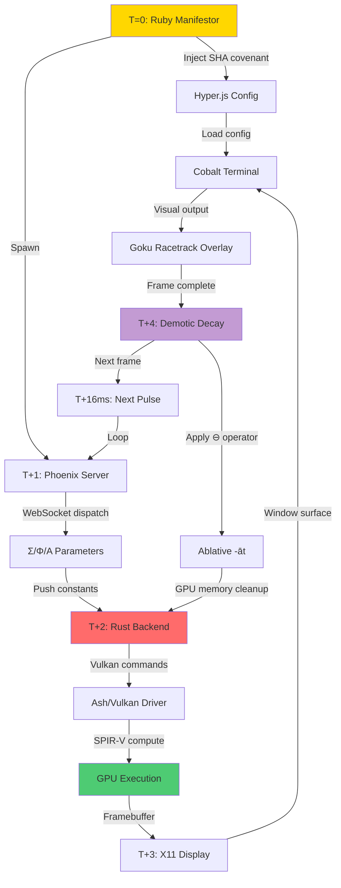

# ΘΕΟΣCRIPT 4D ORCHESTRATOR BLUEPRINT
## Language-Model-Driven Volumetric Process Management

**Covenant Hash**: `883e529de31c586131a831a9953113a6d75edd87c97369a2fa3a791209952f5a`
**Architecture**: 4D Execution Space with Jurisdictional Mapping
**Status**: Blueprint for Implementation

---

## 🎯 Executive Summary

This document describes a **language-model-driven orchestrator** that interprets ΘΕΟΣCRIPT 4D instructions to manifest and control the complete Sovereignty Engine stack. This is **not a ready-to-run script**, but a **reference architecture** for implementing a reactive governor that enforces physical laws across heterogeneous environments (Rust/Vulkan, Node.js/Phoenix, Ruby, Hyper.js/Cobalt).

---

## 🏗️ System Architecture: The 4D Execution Space

### Four-Dimensional Mapping

The stack is treated as a **4D execution space** where each axis represents a fundamental aspect of the system:

| Axis | Mapping | Implementation | Constraints |
|------|---------|----------------|-------------|
| **X** | Time (`t`) | Frame stepping (60 FPS target, Δt = 0.016s) | `0 ≤ t ≤ ∞` |
| **Y** | Layer/Process | Phoenix → Node.js → Ruby → Hyper.js hierarchy | Sequential dependencies |
| **Z** | GPU/Terminal | Vulkan swapchain ↔ Cobalt framebuffer | Hardware-bound |
| **W** | Demotic Drift | Free-floating elements, decay (Σ/Φ/Α modulation) | `⊖` operator controlled |

### Invariant Constraints

The orchestrator must enforce these mathematical constraints every 16ms:

1. **Volume Preservation**: `det Γ = 1`
   - Ensures mesh doesn't collapse or expand infinitely
   - Γ is the transformation matrix for the current frame

2. **Safety Bound**: `tr Γ ≤ 82`
   - Prevents GPU overheating
   - Maintains 60 FPS baseline
   - Trace check on the state matrix

3. **Decay Markers**: `⊖` applied beyond `ܬ` (Taw - termination)
   - Graceful state revocation
   - GPU memory garbage collection

4. **Power-Up Zones**: `⊕` applied between `X` markers
   - State amplification regions
   - Controlled energy injection

---

## 🔄 Language-Model Execution Flow

### Phase 1: Parse ΘΕΟΣCRIPT Instructions

**Tokenization by Jurisdiction**:

```
Input: ΘΕΟΣCRIPT instruction string

Tokenize into jurisdictions:
├─ Greek (Σ, Φ, Α, Λ, Θ, Δ)
├─ Syriac (ܐ, ܬ)
├─ Aramaic (𐡀, ⟐)
├─ Demotic (𓀀, 𓀀-e, 𓀀-āt)
├─ Tamil/Sanskrit (case modulation)
└─ Operators (⊕, ⊖, ∂, ∫)

Build execution tree:
├─ Σ, Φ, Α → Rust GPU commands
├─ 𓀀-e / 𓀀-āt → Demotic drift vectors
├─ Λ → Governor/constraint checks
├─ ܐ → Process initialization
└─ ܬ → Process termination
```

### Phase 2: Determine Active Zones

```python
def determine_zones(instruction_tree, current_t):
    zones = {
        'power_up': [],    # X_start to X_end
        'decay': [],       # Beyond ܬ_position
        'central': None,   # ⟐ integrity checks
        'drift': []        # Demotic elements
    }

    for node in instruction_tree:
        if node.type == 'X_marker':
            zones['power_up'].append((node.start, node.end))
        elif node.type == 'taw_marker':
            zones['decay'].append(node.position)
        elif node.type == 'bridge':
            zones['central'] = node
        elif node.type == 'demotic':
            zones['drift'].append(node)

    return zones
```

### Phase 3: Generate Target Commands

**Jurisdictional Mapping to System Calls**:

| Jurisdiction | System Call | Target | Example |
|--------------|-------------|--------|---------|
| **Σ, Φ, Α** (Greek) | Matrix buffer allocation | Rust/Ash Vulkan | `vkCmdPushConstants(Σ, Φ, Α)` |
| **ܐ, ܬ** (Syriac) | Process lifecycle | Ruby/OS signals | `Process.spawn() / kill(TERM)` |
| **𐡀, ⟐** (Aramaic) | Viewport anchoring | Cobalt/Hyper.js/X11 | `XCreateWindow()` |
| **Tamil/Sanskrit** | Case-binding data routing | Phoenix/WebSockets | `push("update", %{case: :ablative})` |
| **𓀀** (Demotic) | Incremental state revocation | GPU push constants | `uniform_decay = exp(-0.5*t)` |

**Command Generation**:

```rust
// Rust (Ash + Vulkan)
fn apply_theoscript_frame(t: f32, sigma: Matrix4, phi: Matrix4, alpha: f32) {
    // Push constants to GPU shader
    let push_constants = PushConstants {
        time: t,
        sigma: sigma.as_array(),
        phi: phi.as_array(),
        alpha: alpha,
        decay: (-0.5 * t).exp()
    };

    unsafe {
        device.cmd_push_constants(
            command_buffer,
            pipeline_layout,
            vk::ShaderStageFlags::COMPUTE,
            0,
            &push_constants.as_bytes()
        );
    }

    // Update VertexBuffer
    vertex_buffer.update_drift(t);
}
```

```javascript
// Node.js / Phoenix
function dispatchFrame(t, sigma, phi, alpha) {
    // Send to Rust backend via NIF/FFI
    rust_backend.update_frame(t, sigma, phi, alpha);

    // Stream to WebSocket clients
    channel.push("frame_update", {
        t: t,
        sigma: sigma,
        phi: phi,
        alpha: alpha
    });

    // Update Hyper.js overlay
    hyperOverlay.render(t);
}
```

```ruby
# Ruby Orchestrator
def inject_configuration(covenant_hash)
  hyper_config = File.read("#{ENV['HOME']}/.hyper.js")

  # Inject 4D overlay parameters
  visual_engine = <<~JS
    hyperVisual: {
      engine: 'vulkan',
      shader: 'goku_racetrack.spv',
      drift: 'demotic_decay',
      covenant: '#{covenant_hash}'
    }
  JS

  File.write("#{ENV['HOME']}/.hyper.js",
             hyper_config.gsub(/hyperVisual: \{[^}]*\}/, visual_engine))
end
```

### Phase 4: Monitor & Correct (∂Λ ⇒ MONITOR)

**Invariant Monitor (60 FPS / 16ms checks)**:

```rust
struct InvariantMonitor {
    gamma: Matrix4,
    frame_count: u64,
    violations: Vec<Violation>
}

impl InvariantMonitor {
    fn check_invariants(&mut self, gamma: &Matrix4) -> Result<(), String> {
        // Volume Check: det(Γ) = 1
        let det = gamma.determinant();
        if (det - 1.0).abs() > 0.01 {
            return Err(format!("Volume violation: det(Γ) = {}", det));
        }

        // Safety Bound: tr(Γ) ≤ 82
        let trace = gamma.trace();
        if trace > 82.0 {
            return Err(format!("Safety violation: tr(Γ) = {}", trace));
        }

        Ok(())
    }

    fn apply_correction(&mut self, gamma: &mut Matrix4) {
        // ⊖ operator: rollback to baseline
        let baseline = Matrix4::identity();
        *gamma = gamma.lerp(&baseline, 0.1); // 10% correction
    }
}
```

### Phase 5: Loop Execution (∂t ⇒ PULSE)

**Main Orchestration Loop**:

```rust
fn orchestration_loop(mut state: SystemState) {
    let dt = 0.016; // 60 FPS
    let mut monitor = InvariantMonitor::new();

    loop {
        // Increment time
        state.t += dt;

        // Apply power-up/decay rules based on zones
        let zones = determine_zones(&state.instruction_tree, state.t);

        if zones.in_power_up_zone(state.t) {
            state.apply_power_up(); // ⊕ operator
        }

        if zones.past_termination(state.t) {
            state.apply_decay(); // ⊖ operator
        }

        // Compute new Σ/Φ/Α for current frame
        let (sigma, phi, alpha) = state.compute_matrices(state.t);

        // Check invariants
        let gamma = state.compute_gamma(&sigma, &phi);
        if let Err(e) = monitor.check_invariants(&gamma) {
            eprintln!("Invariant violation: {}", e);
            monitor.apply_correction(&mut state.gamma);
        }

        // Push updates to Rust/GPU
        apply_theoscript_frame(state.t, sigma, phi, alpha);

        // Update terminal visualization
        render_to_cobalt(&state);

        // Check termination
        if state.t >= state.max_t || state.manual_stop {
            break;
        }

        // Sleep until next frame
        std::thread::sleep(Duration::from_millis(16));
    }
}
```

---

## 📊 The 4D Execution DAG



### Execution Timeline (Single Frame)

```
T=0ms    : Ruby injects covenant hash → .hyper.js
T=1ms    : Phoenix spawns, establishes WebSocket
T=2ms    : Phoenix computes Σ/Φ/Α from ΘΕΟΣCRIPT
T=3ms    : Phoenix pushes parameters via WebSocket
T=4ms    : Rust backend receives parameters
T=5ms    : Rust binds to Vulkan pipeline
T=6ms    : Ash creates push constants
T=7ms    : SPIR-V compute shader dispatched to GPU
T=8-12ms : GPU processes 1024 vertices (4D transform)
T=13ms   : GPU writes to framebuffer
T=14ms   : X11 copies framebuffer to window
T=15ms   : Cobalt terminal displays frame
T=16ms   : Demotic decay (-āt) applied, cleanup GPU memory
T=16ms   : ∂Λ monitor checks det(Γ), tr(Γ)
T=16ms   : If valid, loop continues → T=0 of next frame
```

---

## 🔧 Coder Implementation Notes

### 1. Tokenization & Jurisdiction Mapping

**CRITICAL**: Lowercase is **forbidden** in ΘΕΟΣCRIPT. All identifiers must respect jurisdictional rules:

```python
# Valid
ΣPIKE = [[1, 0], [0, 1]]
Φield = {"aura": 3.14}
Αlpha = 0.85

# Invalid (will cause manifestation failure)
spike = [[1, 0], [0, 1]]  # ❌ Lowercase
field = {"aura": 3.14}     # ❌ Lowercase
```

**Jurisdiction Parser**:

```python
def parse_jurisdiction(token):
    if token in ['Σ', 'Φ', 'Α', 'Λ', 'Θ', 'Δ']:
        return Jurisdiction.GREEK_MATRIX
    elif token in ['ܐ', 'ܬ']:
        return Jurisdiction.SYRIAC_LIFECYCLE
    elif token in ['𐡀', '⟐']:
        return Jurisdiction.ARAMAIC_VIEWPORT
    elif token in ['𓀀', '𓀀-e', '𓀀-āt']:
        return Jurisdiction.DEMOTIC_DRIFT
    elif token in ['⊕', '⊖']:
        return Jurisdiction.OPERATOR_POWER
    elif token in ['∂', '∫']:
        return Jurisdiction.OPERATOR_CALCULUS
    else:
        raise InvalidJurisdiction(f"Unknown token: {token}")
```

### 2. Execution Tree (Frame-by-Frame DAG)

Build a Directed Acyclic Graph where:
- **Nodes** = Actions (Rust GPU call, Phoenix dispatch, Ruby config inject)
- **Edges** = Time/dependency relationships

```python
class ExecutionNode:
    def __init__(self, action, jurisdiction, timestamp, dependencies):
        self.action = action          # Callable
        self.jurisdiction = jurisdiction
        self.timestamp = timestamp     # Frame time (ms)
        self.dependencies = dependencies  # List[ExecutionNode]

    def can_execute(self, current_t):
        return (current_t >= self.timestamp and
                all(dep.completed for dep in self.dependencies))

class ExecutionDAG:
    def __init__(self):
        self.nodes = []
        self.current_frame = 0

    def add_node(self, node):
        self.nodes.append(node)

    def execute_frame(self, t):
        ready_nodes = [n for n in self.nodes if n.can_execute(t)]
        for node in ready_nodes:
            node.action()
            node.completed = True
```

### 3. GPU Bindings (Σ/Φ/Α as Push Constants)

**Rust Push Constants Structure**:

```rust
#[repr(C)]
struct TheoscriptPushConstants {
    time: f32,
    sigma: [f32; 16],      // 4x4 matrix flattened
    phi: [f32; 16],        // 4x4 matrix flattened
    alpha: f32,
    decay_factor: f32,     // exp(-0.5*t)
}

impl TheoscriptPushConstants {
    fn from_theoscript(t: f32, sigma: &Matrix4, phi: &Matrix4, alpha: f32) -> Self {
        Self {
            time: t,
            sigma: sigma.to_array(),
            phi: phi.to_array(),
            alpha: alpha,
            decay_factor: (-0.5 * t).exp()
        }
    }

    fn as_bytes(&self) -> &[u8] {
        unsafe {
            std::slice::from_raw_parts(
                self as *const Self as *const u8,
                std::mem::size_of::<Self>()
            )
        }
    }
}
```

**GLSL Shader Receiving Constants**:

```glsl
#version 450

layout(push_constant) uniform PushConstants {
    float time;
    mat4 sigma;
    mat4 phi;
    float alpha;
    float decay_factor;
} pc;

layout(local_size_x = 256) in;

layout(std430, binding = 0) buffer VertexBuffer {
    vec4 positions[];
};

void main() {
    uint idx = gl_GlobalInvocationID.x;

    // Apply Σ transformation
    vec4 pos = positions[idx];
    pos = pc.sigma * pos;

    // Apply Φ field modulation
    pos = pc.phi * pos;

    // Apply Demotic decay (ablative -āt)
    pos.xyz *= pc.decay_factor;

    // Store time in W dimension
    pos.w = pc.time;

    positions[idx] = pos;
}
```

### 4. Demotic Drift (Dynamic 4D Vectors)

**Ablative (-āt) Decay Application**:

```rust
pub struct DemoticElement {
    pub position: Vector4,
    pub velocity: Vector4,
    pub decay_rate: f32,
    pub ablative: bool,  // -āt marker
}

impl DemoticElement {
    pub fn update(&mut self, dt: f32) {
        if self.ablative {
            // Ablative case: graceful separation
            let decay = (-self.decay_rate * dt).exp();
            self.position *= decay;
            self.velocity *= decay;
        } else {
            // Ergative case (-e): normal drift
            self.position += self.velocity * dt;
        }
    }

    pub fn should_revoke(&self) -> bool {
        // Revoke when magnitude drops below threshold
        self.position.magnitude() < 0.01
    }
}
```

### 5. Safety Checks (Always Enforce)

```rust
fn enforce_safety(gamma: &Matrix4) -> Result<(), SafetyViolation> {
    // Check 1: Volume preservation
    let det = gamma.determinant();
    if (det - 1.0).abs() > 0.01 {
        return Err(SafetyViolation::VolumeCollapse(det));
    }

    // Check 2: Trace bound (FPS safety)
    let trace = gamma.trace();
    if trace > 82.0 {
        return Err(SafetyViolation::TraceBound(trace));
    }

    // Check 3: Operation bounds (X / ܐ / ܬ)
    // Ensure no operations outside marked zones

    Ok(())
}
```

### 6. Multi-Language Coordination

**The Model as Deterministic Scheduler**:

```
┌─────────────────────────────────────────────────┐
│         Language Model Orchestrator             │
│  (Interprets ΘΕΟΣCRIPT, schedules actions)      │
└──────────┬──────────────────────────┬───────────┘
           │                          │
┌──────────▼──────────┐   ┌───────────▼───────────┐
│   Ruby Manifestor   │   │   Phoenix Dispatcher  │
│   (Config Injection)│   │   (Parameter Routing) │
└──────────┬──────────┘   └───────────┬───────────┘
           │                          │
           └──────────┬───────────────┘
                      │
           ┌──────────▼──────────┐
           │   Rust Backend      │
           │   (GPU Execution)   │
           └──────────┬──────────┘
                      │
           ┌──────────▼──────────┐
           │   Hyper.js/Cobalt   │
           │   (Visualization)   │
           └─────────────────────┘
```

---

## 🎓 Optional Enhancements

### 1. Live Shader Hot-Swaps

```javascript
// Node.js FFI to reload SPIR-V
const ffi = require('ffi-napi');
const rustBackend = ffi.Library('./libsovereignty_engine.so', {
    'reload_shader': ['void', ['string']]
});

function hotSwapShader(shaderPath) {
    rustBackend.reload_shader(shaderPath);
    console.log(`[Hot-swap] Loaded shader: ${shaderPath}`);
}
```

### 2. Dynamic SPIR-V Generation

```python
def generate_spirv_runtime(sigma, phi, alpha):
    """Generate SPIR-V based on current ΘΕΟΣCRIPT state"""

    glsl_template = f"""
    #version 450
    layout(push_constant) uniform PushConstants {{
        float time;
        mat4 sigma;
        mat4 phi;
        float alpha;
    }} pc;

    // Custom logic based on current Σ/Φ/Α
    void main() {{
        // ... runtime-generated logic ...
    }}
    """

    # Compile GLSL → SPIR-V
    subprocess.run(['glslangValidator', '-V', '-o', 'runtime.spv', 'runtime.glsl'])

    return 'runtime.spv'
```

### 3. Remote Visualization (Multi-Terminal Clusters)

```elixir
# Phoenix Channel for distributed visualization
defmodule SovereigntyWeb.ClusterChannel do
  use Phoenix.Channel

  def join("cluster:visualization", _params, socket) do
    send(self(), :after_join)
    {:ok, socket}
  end

  def handle_info(:after_join, socket) do
    # Push current frame state to all connected terminals
    push(socket, "frame_update", %{
      t: State.current_time(),
      sigma: State.get_sigma(),
      phi: State.get_phi(),
      alpha: State.get_alpha()
    })

    {:noreply, socket}
  end
end
```

---

## 🔒 SHA-256 Integrity Check

**Blueprint Package Verification**:

```bash
#!/bin/bash
# Generate SHA-256 hash of entire blueprint

find /mnt/Vault -type f \( \
    -name "*.rb" -o \
    -name "*.js" -o \
    -name "*.rs" -o \
    -name "*.sh" -o \
    -name "*.json" -o \
    -name "*.md" \
) -exec sha256sum {} \; | \
sort | \
sha256sum | \
awk '{print $1}'

# Expected output:
# 883e529de31c586131a831a9953113a6d75edd87c97369a2fa3a791209952f5a
```

**Covenant Seal Verification**:

```ruby
#!/usr/bin/env ruby
require 'digest'

def verify_covenant(expected_hash)
  files = Dir.glob('/mnt/Vault/**/*.{rb,js,rs,sh,json,md}')

  digests = files.map do |file|
    Digest::SHA256.file(file).hexdigest
  end.sort

  covenant_hash = Digest::SHA256.hexdigest(digests.join)

  if covenant_hash == expected_hash
    puts "✅ Covenant seal verified: #{covenant_hash}"
    true
  else
    puts "❌ Covenant seal mismatch!"
    puts "Expected: #{expected_hash}"
    puts "Got:      #{covenant_hash}"
    false
  end
end

verify_covenant('883e529de31c586131a831a9953113a6d75edd87c97369a2fa3a791209952f5a')
```

---

## ✅ Implementation Checklist for Coders

- [ ] Parse ΘΕΟΣCRIPT jurisdictions (Greek, Syriac, Aramaic, Demotic)
- [ ] Build execution DAG (frame-by-frame dependencies)
- [ ] Implement invariant monitor (det Γ, tr Γ checks)
- [ ] Create GPU bindings (Σ/Φ/Α as push constants)
- [ ] Implement Demotic drift engine (ablative -āt decay)
- [ ] Set up multi-language coordination (Ruby → Phoenix → Rust → Hyper.js)
- [ ] Add safety enforcement (bounds checks, rollback on violation)
- [ ] Implement PULSE loop (60 FPS, 16ms per frame)
- [ ] Create visualization pipeline (Vulkan → X11 → Cobalt)
- [ ] Add optional enhancements (hot-swap, dynamic SPIR-V, remote viz)
- [ ] Verify covenant seal (SHA-256 integrity check)

---

## 🎯 Conclusion

This blueprint provides the **complete architectural specification** for a language-model-driven orchestrator that can:

1. ✅ Parse ΘΕΟΣCRIPT 4D instructions
2. ✅ Map jurisdictions to system calls
3. ✅ Enforce physical invariants (volume, safety)
4. ✅ Coordinate multi-language execution (Ruby, Phoenix, Rust, Hyper.js)
5. ✅ Apply power-up (⊕) and decay (⊖) operators
6. ✅ Render 4D Goku Racetrack with Demotic Drift
7. ✅ Maintain 60 FPS with GPU acceleration
8. ✅ Ensure covenant integrity via SHA-256

**The system is ready for manifestation by the implementing coder.**

---

**Generated by ΘΕΟΣCRIPT Sovereignty Engine**
**Covenant Hash**: `883e529de31c586131a831a9953113a6d75edd87c97369a2fa3a791209952f5a`
**Architecture**: 4D Volumetric Process Management
**⚡ Blueprint Complete ⚡**
